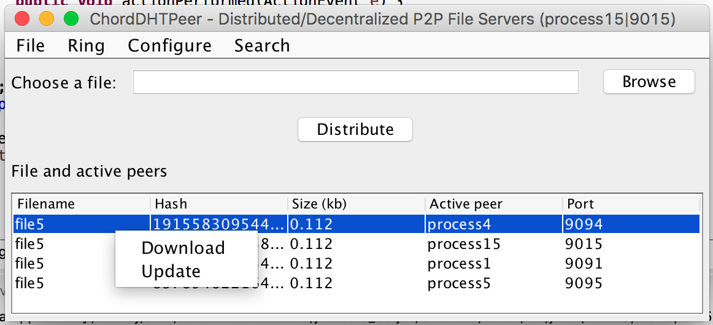
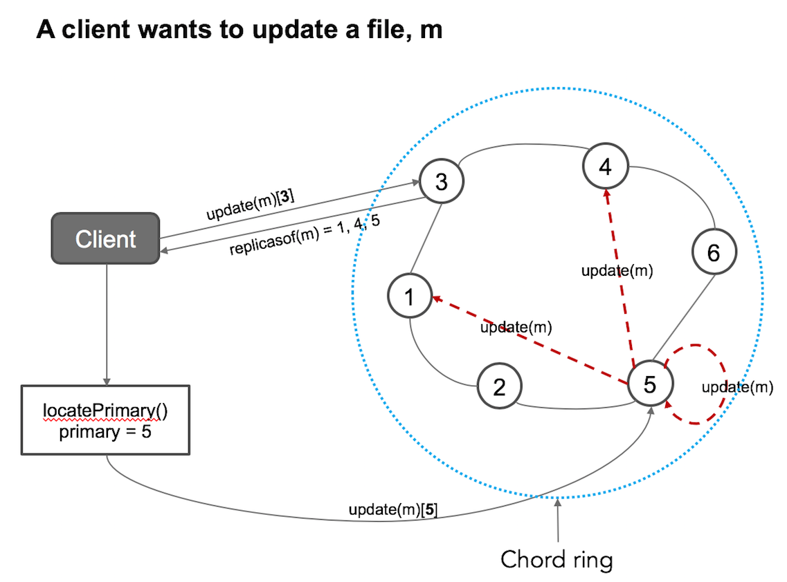
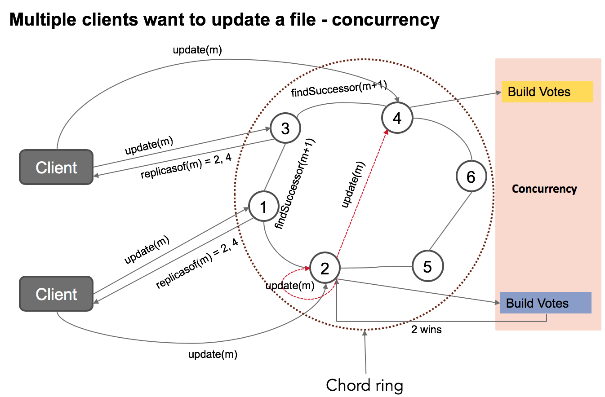

### Project 3 - Weeks 13 and 14: 23/03 - 03/04

### DHT Cooperative Mirroring with consistency protocol and Distributed Mutual Exclusion.

The project assumes that you have read and understood the following sections in the Distributed system book:
- Section 5.2 - Distributed hash tables (DHT) (Naming)
- Section 6.3 - Mutual Exclusion Distributed algorithm (Coordination)
- Section 7.5 - Remote-write protocols (Consistency and Replication)

Therefore the project builds on exercise 8 - Chord Distributed Hash Table (https://github.com/selabhvl/dat110public-2020/blob/master/week8/week8.md)

### Description of project
This implementation is based on synchronous communication by using the Java RMI remote procedure call (RPC)
The system works under these models and assumptions
- Our protocol uses strict, sequential consistency model and replicated write protocol
- We assume no message loss during communications
- We assume that network is stable and there is no communication failure

A DHT can be used to build a cooperative mirroring peer-to-peer distributed system in which multiple providers of content cooperate to store and serve each others’ data.

#### Design
The idea behind cooperative mirroring is that a node can replicate its content among other nodes in the p2p system. In the DHT implementation, this replication is done dynamically where nodes can be assigned a file if the hash value (key) of a replica of this file maps to the hash value (id) of the node.

In this project, we can replicate a resource (e.g. a file) and distribute the replicas to running processes (peers) that are arranged in a ring topology. This design provides fault-tolerance and high availability for the resource.
However, to achieve these qualities require an efficient naming system. The DHT system provides the mechanism to pair a resource to the address where it can be stored and located.
Given a resource (e.g. a file), we can lookup the DHT system for the server(s) storing this file. The DHT system uses the same address space for naming a resource and its access point (peers).

The project is divided into six packages:

- no.hvl.dat110.chordoperations: contains the ChordProtocols and JoinRing classes.

- no.hvl.dat110.main: Contains chord GUI that can be used to distribute file, lookup file, and update file. You join the ring by clicking "Ring" menu and Create/Join Ring. Note that when you are testing, the GUI process should not be part of the processes as it will correspond to having 6 active processes whereas the unit test results have been built with 5 processes (process1 - process5).

- no.hvl.dat110.rpc.interfaces: contains an interface (NodeInterface) with methods that peers can invoke remotely

- no.hvl.dat110.middleware: contains the class 'Node' which implements the remote methods. It also contains the NodeServer where the registry can be started and Node stub can be made available. The Message class is used to store the message we want to send among the nodes and to send back acknowledgements to the sender process. In addition, we can use it to specify the primary for a file. MutualExclusion, ChordLookup, and UpdateOperations classes are auxiliary classes for various operations performed by the Node class

- no.hvl.dat110.node.client: contains five processes which are instances of Node and have been pre-configured with nodenames and port numbers to form a ring. Process1 class must be started first, followed by other classes. 

- no.hvl.dat110.util: contains the Hash class for defining address space by using MD5 hash function and computing the identifier for an entity; the Util class provides method for getting a process stub, creating the replica of a file, and
checking if a key lies within a node/peer and its predecessor. (pred < key <= node). FileManager: contains methods for creating replicas of a file, distributing those replicas among active nodes in the chord ring, and looking up the active nodes responsible for a given file by iteratively resolving the replicaid (hash of replica) from an active node.

The current implementation of the project allows the simulation of chord ring in a single machine environment but it can be simply modified to use multiple computers by using IP address for the nodename.

### Organisation

The project will be carried out in weeks 13 and 14. We will use existing group size limit. Discussions among the groups are allowed, but the code handed in by the group should be the work of the group members - and not members of other groups.
Submission of your code should follow previous formats on canvas.

### Getting Started

You should start by cloning the Java code which can be found in this github repository.

https://github.com/selabhvl/dat110-project3-startcode.git

which contains an Eclipse-project for both the ChordDHT with start-code. In addition, it also contains a number of unit tests which can be used for testing the implemented functionalities. The unit-tests should not be modified/removed as they will be used for evaluation of the submitted solution.

You should also separately clone the unit test cases which can be found in this repository.

https://github.com/selabhvl/dat110-project3-testing.git

In order for the group to use their own git-repository for further work on the codebase, one member of the group must create an empty repository on github/bitbucket without a README file and without a `.gitignore` file, and then perform the following operations

`git remote remove origin`

`git remote add origin <url-to-new-empty-repository>`

`git push -u origin master`

The other group members can now clone this new repository and work with a shared repository as usual.

### Complete ChordDHT with Consistency protocol and Distributed Mutual Exclusion

### Preambles - IDEs for project and unit testing
You will need to maintain two IDEs (e.g. 2 eclipse windows). One for the project (https://github.com/selabhvl/dat110-project3-startcode.git) and another one for the unit-test project (https://github.com/selabhvl/dat110-project3-testing.git).
In the unit-test IDE, you will also need to import the original project into the IDE workspace but make sure you DO NOT SELECT THE OPTION TO COPY THE PROJECT INTO THE WORKSPACE. The project must be using the same directory as in the first IDE. You can then configure your build path for the unit-test project to include the original project as a required project.
Attempting to test using the same IDE will be difficult because you will have processes that are running with multiple threads and printing info to the output at a regular interval. Therefore, when you have implemented missing functionalities and need to test, you should start the 5 processes located in (no.hvl.dat110.peers) and switch to the IDE holding the unit test classes to test whichever functionalities you have implemented.
Running the processes outside of the IDE is also possible. You can jar the processes using the script located in /chordjars. To do this, you should copy the bin folder containing compiled classes from your project into the chordjars folder, go to the terminal, change directory to the chordjars folder and execute the bash script ./chord.sh
You can then open new windows/tabs from your terminal and execute $> java -jar process1.jar and repeat this for the remaining 4 processes in their own window. 

### Tasks

The tasks are divided into 7 parts

#### Task 1 - Address space and size 

In this task, you will implement the methods hashOf(), addressSize() and bitSize() in the Hash class. You must use the MD5 hash algorithm because the unit test cases class are generated using MD5 hash.
MD5 compresses strings to 128bits, thus the address size will be 2^128 = 340282366920938463463374607431768211456.
Note that the peers (process1, process2, process3, process4, process5) have been given identifiers from the same address space. You will find this in the Node class: nodeID = Hash.hashOf(nodename);
 - Testing: Use the DHTTestHashFunction to test your implementation. You do not need to start all the processes to test this functionality

#### Task 2 - Creating Replicas of file using the address space (2^128)
This task requires that you replicate files using index from 0 to 3 (numReplicas = 4). You can simply use the Util.numReplicas for this purpose. That is, the index must be added to the filename to generate replicas. (e.g. for a file with name, "test", replicas will be:
test0, test1, test2, test3. Each replica will now be named using the hash function you have implemented in Task 1. Your task here is to implement this functionality in the createReplicaFiles() method in the FileManager class.
 - Testing: Use the DHTTestFileReplicas to test your implementation.
 
#### Task 3 - Lookup logic and findSuccessor function
The findSuccessor(id) method is a core method in the DHT system for recursively or iteratively resolving (looking up) a key from any node/peer. The first important task you must solve here before implementing the findsuccessor functions is to implement the logic to check the rule: lower <= id <= upper in the computeLogic() method in the Util class. For example, in mod 10, we check whether 9 lies between 6 and 2. It means id = 9, lower = 6 and upper = 2. (6, 2) in mod 10 = {6, 7, 8, 9, 0, 1, 2}. Your logic should return true. Further, we can check if id=6 lies between (6, 2). A correct implementation will return true. 
You may need to read pg. 247-249 of the DS book and the original paper on chord system. The paper is on Canvas.
After you have successfully implemented the logic, you can then implement the findSuccessor function in the ChordLookup class. To correctly implement this function, you need to maintain a finger table for each node and also implement findHighestPredecessor method that uses the finger table to find the closest predecessor peer to a key. For this project, the finger table has already been implemented.
 - Testing: Use the DHTTestComputeLogic and DHTTestFindSuccessor to test your implementations. You do not need to start all the processes to test DHTTestComputeLogic.

#### Task 4 - Distributing file replicas to peers
In the chord ring system, a peer has a predecessor and a successor. Identifiers (addresses) that are higher than the predecessor and lower or equal to the identifier of the peer are managed by the peer.
Our replica is thus distributed using the simple rule: pred < replica <= peer. If the replica's id is less than or equal to a peer's identifier and greater than the identifier of the peer's predecessor, we assign the replica to this peer.
You will be able to use the findSuccessor function you have implemented earlier for this purpose. To do this correctly, you will invoke node.findSuccessor(replica) for each replica.
Your task is to implement the distributeReplicastoPeers() in the FileManager class.
 - Testing: Use the DHTTestKeys to test your implementation.

#### Task 5 - Finding the peers/servers responsible for a file
To look up a file in a chord system, we need to perform the same process in Task 4, where we replicate the file and find the peers holding each replica according to the rule. The system then returns the peers to the client.
The major task here is to implement the requestActiveNodesForFile() method in the FileManager. Given a filename, find all the peers that hold a copy of this file
- Testing: Use the DHTTestFilePeers to test your implementation.

#### Task 6 - Remote-write protocol
The basic idea for remote write is that each file (data item) has a primary peer that is responsible for performing update. Whenever a client wants to update a file, it has to locate the primary for this file and forward the update request to it. Therefore, only one process (peer) can perform update. The primary can then tell other peers holding a copy of this file to update.
This arrangement is illustrated in the figure below.

We will implement this replicated-write protocol (remote-write) on top of the chord. One way to do this, is to tag a replica as the primary item before we distribute to the ring. The primaryServer variable in the Message class can be used for this purpose.
We can then implement this logic in the distributeReplicastoPeers() in the FileManager class.
Subsequently, to locate the primary for a file, we need to first requestActiveNodesForFile(filename) and then iterate over the returned peers to find who holds the primary copy.
The task first, is to modify the distributeReplicastoPeers() to randomly assign a primary peer to a file replica.
Next, implement findPrimaryOfItem() that returns the primary node for this item (file).
A client request to a node to update a file using these implementations is illustrated in the unit test class (DHTTestRemote) where the client issues a request by invoking the requestRemoteWriteOperation() in the contacted node/peer.
- Testing: Use the DHTTestRemote to test your implementation.

#### Task 7 -  Distributed Mutual Exclusion Algorithm
The distributed mutual exclusion algorithm makes it possible to synchronize access to a critical section from concurrently running processes. In this scheme, multiple clients may attempt to update a single file by contacting different replicas (peers) as illustrated in the figure below.
Each contacted replica can then request a permission from the remaining replicas for this file for access to the critical section. The node that receives permission will update its local copy and tell the rest to update their local copies.
Your task is to implement the distributed mutual exclusion algorithm in the MutualExclusion class.

- Testing: Use the DHTTestMutex to test your implementation.

### Unit tests
Tasks 3 to 7 require that the 5 chord processes are started before you can test your implementations.
- no.hvl.dat110.unit.tests: contains all the unit test cases for the project.
- no.hvl.dat110.utility.FileDistributorClient: should be used to distribute files (5 files from the file folder) to the replicas in the chord ring. Note that the 5 processes must have been started before running this class. 
- no.hvl.dat110.utility.FileFinderClient: can be used as client that requests for all server replicas holding any of the distributed files.
- no.hvl.dat110.utility.RingMonitor: can be run to see if the ring is correct.